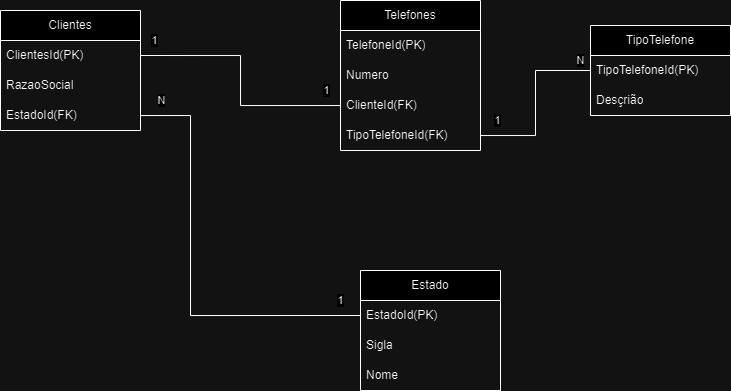

1. 82
2.
- a 9
- b 128
- c 49
- d 100
- e 11
- f 20

3.

`
public void Faturamento(double[] faturamento){
        double min = double.MaxValue;
        double max = double.MinValue;
        double soma = 0;
        int diasComFaturamento = 0;

        foreach (double valor in faturamento)
        {
            if (valor > 0)
            {
                if (valor < min) min = valor;
                if (valor > max) max = valor;
                soma += valor;
                diasComFaturamento++;
            }
        }

        double media = soma / diasComFaturamento;
        int diasAcimaDaMedia = 0;

        foreach (double valor in faturamento)
        {
            if (valor > media) diasAcimaDaMedia++;
        }

        Console.WriteLine($"Menor faturamento: {min}");
        Console.WriteLine($"Maior faturamento: {max}");
        Console.WriteLine($"Dias com faturamento acima da média: {diasAcimaDaMedia}");

}
`

4. 	

`
SELECT c.ClienteID, c.RazaoSocial, t.Numero
FROM Clientes c
JOIN Estados e ON c.EstadoID = e.EstadoID
LEFT JOIN Telefones t ON c.ClienteID = t.ClienteID
WHERE e.Sigla = 'SP';
`

5.
- a Aproximadamente 0.735 horas
- b Aproximadamente 0.985 horas
- c Carro 1: aproximadamente 88,65 km; Carro 2 aproximadamente 58,8 km 